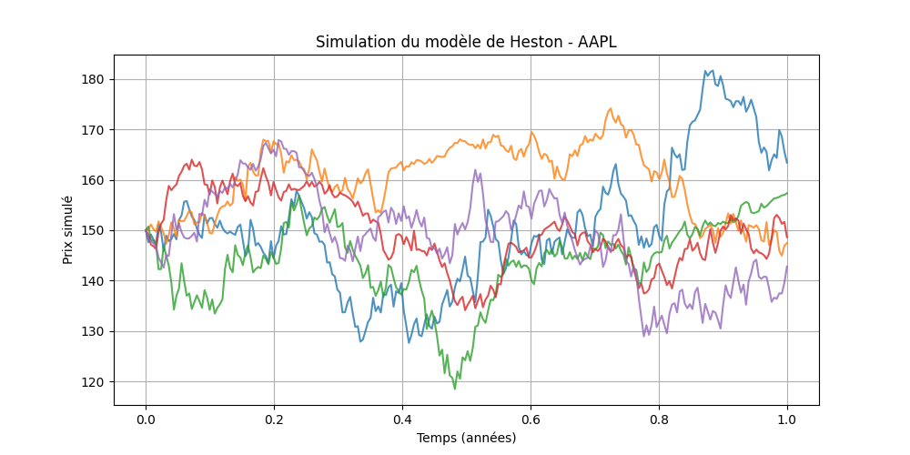

# 📘 Heston Model Simulation

Ce module permet de **simuler le modèle de Heston** pour un ou plusieurs actifs, en générant des trajectoires de prix et de variance.

## 📄 Description rapide
Le modèle de Heston est un modèle de volatilité stochastique largement utilisé en finance.  
Il décrit l'évolution conjointe du prix d'un actif **S_t** et de sa variance **v_t** :

- **dS_t = μ S_t dt + √(v_t) S_t dW₁_t**  
- **dv_t = κ(θ − v_t) dt + σ √(v_t) dW₂_t**  

Avec :  
- μ : drift du prix  
- κ : vitesse de retour de la variance vers sa moyenne de long terme θ  
- σ : volatilité de la variance  
- ρ : corrélation entre les deux bruits browniens W₁ et W₂  

---

## ⚙️ Fonction principale

```python
heston_simulation_dict(params_dict, n_paths, T, dt)
```

### Arguments
- `params_dict` : dictionnaire contenant les paramètres pour chaque actif. Exemple :
```python
{
    "AAPL": {"S0": 150, "v0": 0.04, "mu": 0.05, "kappa": 2.0, "theta": 0.04, "sigma": 0.3, "rho": -0.7}
}
```
- `n_paths` : nombre de trajectoires simulées  
- `T` : horizon temporel en années  
- `dt` : pas de temps (ex. `1/252` pour quotidien)

### Retour
Un dictionnaire structuré :
```python
{
  "AAPL": {
    "trajectories": [
      {"path_id": 0, "S": [...], "V": [...]},
      ...
    ],
    "t": [0.0, 0.0039, ...]
  }
}
```

---

## 🚀 Exemple d’utilisation (avec affichage)

```python
if __name__ == "__main__":
    import matplotlib.pyplot as plt

    params = {
        "AAPL": {
            "S0": 150,
            "v0": 0.04,
            "mu": 0.05,
            "kappa": 2.0,
            "theta": 0.04,
            "sigma": 0.3,
            "rho": -0.7
        }
    }

    sim = heston_simulation_dict(params, n_paths=5, T=1, dt=1/252)

    t = sim["AAPL"]["t"]
    plt.figure(figsize=(10, 5))
    for traj in sim["AAPL"]["trajectories"]:
        plt.plot(t, traj["S"], alpha=0.8)
    plt.title("Simulation du modèle de Heston - AAPL")
    plt.xlabel("Temps (années)")
    plt.ylabel("Prix simulé")
    plt.grid(True)
    plt.show()
```

---

## 📊 Résultat attendu

Ce code affichera **plusieurs trajectoires de prix** sur 1 an avec un pas quotidien :



---

Made with ⚡ pour simuler plus vite.
