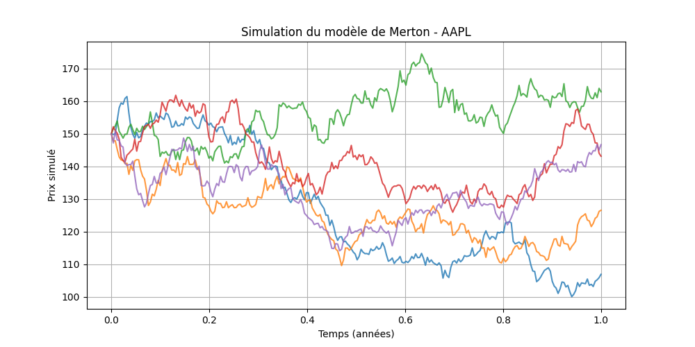

# 📘 Merton Jump-Diffusion Model Simulation

Ce module permet de **simuler le modèle de Merton** (jump-diffusion) pour un ou plusieurs actifs, en générant des trajectoires de prix avec des sauts.

## 📄 Description rapide
Le modèle de Merton est un modèle de diffusion avec sauts utilisé en finance pour modéliser les variations soudaines des prix d'actifs.  
Il décrit l'évolution du prix d'un actif **S_t** comme suit :

- **dS_t = μ S_t dt + σ S_t dW_t + S_t dJ_t**

Avec :  
- μ : drift du prix  
- σ : volatilité de la composante diffusion  
- W_t : mouvement brownien standard  
- J_t : processus de Poisson composé, avec intensité λ (nombre moyen de sauts par an) et tailles de saut Y ~ N(μ_J, σ_J²)  

---

## ⚙️ Fonction principale

```python
merton_simulation_dict(params_dict, n_paths, T, dt)
```

### Arguments
- `params_dict` : dictionnaire contenant les paramètres pour chaque actif. Exemple :
```python
{
    "AAPL": {"S0": 150, "mu": 0.05, "sigma": 0.2, "lambda_jump": 0.5, "mu_J": 0.0, "sigma_J": 0.1}
}
```
- `n_paths` : nombre de trajectoires simulées  
- `T` : horizon temporel en années  
- `dt` : pas de temps (ex. `1/252` pour quotidien)

### Retour
Un dictionnaire structuré :
```python
{
  "AAPL": {
    "trajectories": [
      {"path_id": 0, "S": [...]},
      ...
    ],
    "t": [0.0, 0.0039, ...]
  }
}
```

---

## 🚀 Exemple d’utilisation (avec affichage)

```python
if __name__ == "__main__":
    import matplotlib.pyplot as plt

    params = {
        "AAPL": {
            "S0": 150,
            "mu": 0.05,
            "sigma": 0.2,
            "lambda_jump": 0.5,
            "mu_J": 0.0,
            "sigma_J": 0.1
        }
    }

    sim = merton_simulation_dict(params, n_paths=5, T=1, dt=1/252)

    t = sim["AAPL"]["t"]
    plt.figure(figsize=(10, 5))
    for traj in sim["AAPL"]["trajectories"]:
        plt.plot(t, traj["S"], alpha=0.8)
    plt.title("Simulation du modèle de Merton - AAPL")
    plt.xlabel("Temps (années)")
    plt.ylabel("Prix simulé")
    plt.grid(True)
    plt.show()
```

---

## 📊 Résultat attendu

Ce code affichera **plusieurs trajectoires de prix** sur 1 an avec un pas quotidien, montrant des sauts occasionnels :



---

Made with ⚡ pour simuler plus vite.
