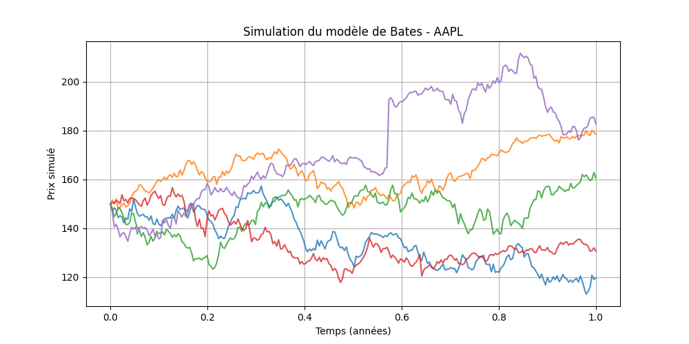

# 📘 Bates Model Simulation

Ce module permet de **simuler le modèle de Bates** (volatilité stochastique + sauts) pour un ou plusieurs actifs, en générant des trajectoires de prix et de variance.

## 📄 Description rapide
Le modèle de Bates combine le modèle de Heston (volatilité stochastique) et le modèle de Merton (sauts) pour modéliser des dynamiques d'actifs complexes.  
Il décrit l'évolution conjointe du prix d'un actif **S_t** et de sa variance **v_t** :

- **dS_t = μ S_t dt + √(v_t) S_t dW₁_t + S_t dJ_t**  
- **dv_t = κ(θ − v_t) dt + σ √(v_t) dW₂_t**  

Avec :  
- μ : drift du prix  
- κ : vitesse de retour de la variance vers sa moyenne de long terme θ  
- σ : volatilité de la variance  
- ρ : corrélation entre les deux bruits browniens W₁ et W₂  
- J_t : processus de Poisson composé, avec intensité λ (nombre moyen de sauts par an) et tailles de saut Y ~ N(μ_J, σ_J²)  

---

## ⚙️ Fonction principale

```python
bates_simulation_dict(params_dict, n_paths, T, dt)
```

### Arguments
- `params_dict` : dictionnaire contenant les paramètres pour chaque actif. Exemple :
```python
{
    "AAPL": {
        "S0": 150,
        "v0": 0.04,
        "mu": 0.05,
        "kappa": 2.0,
        "theta": 0.04,
        "sigma": 0.3,
        "rho": -0.7,
        "lambda_jump": 0.5,
        "mu_J": 0.0,
        "sigma_J": 0.1
    }
}
```
- `n_paths` : nombre de trajectoires simulées  
- `T` : horizon temporel en années  
- `dt` : pas de temps (ex. `1/252` pour quotidien)

### Retour
Un dictionnaire structuré :
```python
{
  "AAPL": {
    "trajectories": [
      {"path_id": 0, "S": [...], "V": [...]},
      ...
    ],
    "t": [0.0, 0.0039, ...]
  }
}
```

---

## 🚀 Exemple d’utilisation (avec affichage)

```python
if __name__ == "__main__":
    import matplotlib.pyplot as plt

    params = {
        "AAPL": {
            "S0": 150,
            "v0": 0.04,
            "mu": 0.05,
            "kappa": 2.0,
            "theta": 0.04,
            "sigma": 0.3,
            "rho": -0.7,
            "lambda_jump": 0.5,
            "mu_J": 0.0,
            "sigma_J": 0.1
        }
    }

    sim = bates_simulation_dict(params, n_paths=5, T=1, dt=1/252)

    t = sim["AAPL"]["t"]
    plt.figure(figsize=(10, 5))
    for traj in sim["AAPL"]["trajectories"]:
        plt.plot(t, traj["S"], alpha=0.8)
    plt.title("Simulation du modèle de Bates - AAPL")
    plt.xlabel("Temps (années)")
    plt.ylabel("Prix simulé")
    plt.grid(True)
    plt.show()
```

---

## 📊 Résultat attendu

Ce code affichera **plusieurs trajectoires de prix** sur 1 an avec un pas quotidien, montrant des variations de volatilité et des sauts occasionnels :



---

Made with ⚡ pour simuler plus vite.
